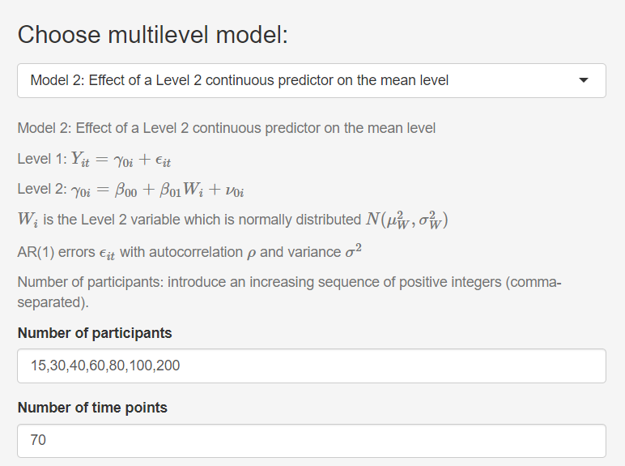
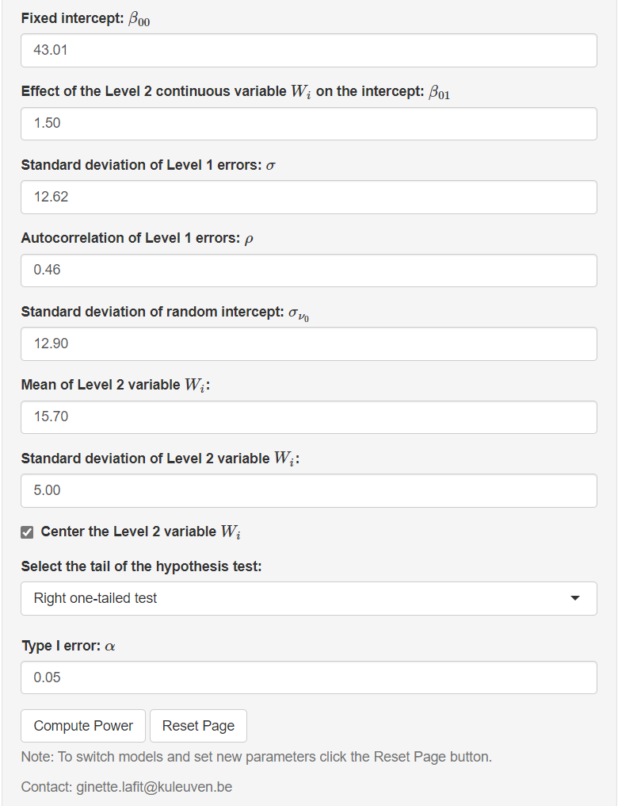
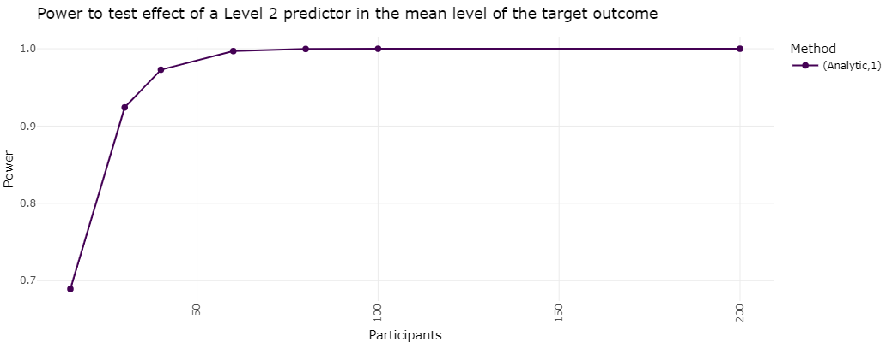
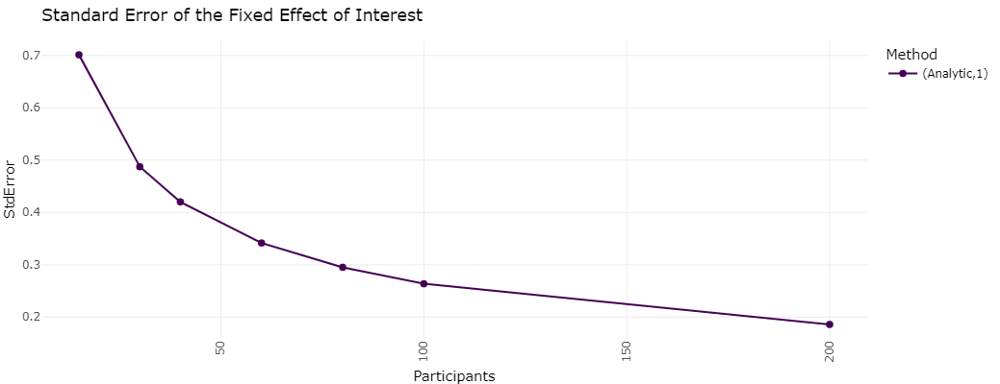

# ApproxPowerIL

A Shiny application and R package to perform power analysis to select the number of persons for multilevel models with autocorrelated errors using asymptotic approximations of the information matrix

The repository contains functions used in the following [preprint](https://psyarxiv.com/tj5bv): Lafit, G., Artner, R., & Ceulemans, E. (2023, February 24). Enabling analytical power calculations for multilevel models with autocorrelated errors through deriving and approximating the information matrix.

Users can download the app and run locally on their computer by executing the following commands in R or Rstudio. 

```
# Check if R packages are installed
list.of.packages = c("tidyverse","gridExtra","formattable","htmltools",
"shiny","DT","ggplot2","plyr","dplyr","tidyr","shinyjs","shinythemes","viridis","ploty","remotes")
new.packages = list.of.packages[!(list.of.packages %in% installed.packages()[,"Package"])]
if(length(new.packages)) install.packages(new.packages)

# Load packages
library(tidyverse)
library(gridExtra)
library(formattable)
library(htmltools)
library(shiny)
library(DT)
library(ggplot2)
library(plyr)
library(dplyr)
library(tidyr)
library(shinyjs)
library(shinythemes)
library(viridis)
library(plotly)
library(remotes)

# Install package from GitHub repository
remotes::install_github("ginettelafit/ApproxPowerIL", force = T)

# Load package ApproxPowerIL
library(ApproxPowerIL)

# Using Gist: users can launch this app with:
shiny::runGist('302737dc046b89b7f09d15843389161c')

```

## How the app works in a nutshell

The shiny app focuses on a set of research questions regarding multilevel models with autocorrelated errors. The application allows conducting power analysis to select the number of persons using asymptotic approximations of the information matrix of the standard errors of fixed effects estimates for five two-level models commonly used in intensive longitudinal designs. For these models, when the number of persons and the number of repeated measurement occasions per person is sufficiently large we can obtain a closed-form expression of the standard error of the fixed effect estimates by deriving and approximating the information matrix of the fixed effect estimates of two-level models with autocorrelated errors. Using this closed-form expression, we use the analytic approach to compute statistical power for fixed effects in multilevel models with AR(1) errors, without having to fit the model to large amounts of simulated datasets.

We distinguish five different two-level models where the within-person errors follow an AR(1) process: 

* Model 1 includes a Level 2 or time-invariant continuous predictor that allows investigating changes in the mean level of an outcome due to changes in the person-level predictor. 
* Model 2 includes a Level 2 binary predictor to estimate differences in the mean level of the outcome between two groups of persons.
* Model 3 estimates the fixed within-person association between a Level 1 or time-varying predictor and the outcome. 
* Model 4 extends model 3 by including a Level 2 continuous predictor to investigate cross-level interaction effects between the time-varying predictor and the time-invariant predictor. 
* Model 5 extends the third model by including a binary Level 2 predictor to estimate group differences in the within-persons associations between the time-varying predictor and the outcome. 

[Lafit et al. (2023)](https://psyarxiv.com/tj5bv) includes a the analytic derivation of the information matrix of Models 1 to 5.

To illustrate how the app works we will consider a researcher who is planning an Intensive Longitudinal (IL) study to test the hypothesis that depression (level-2 continuous variable) is positively related to negative affect (Affect).


where the level-1 and level-2 errors are mutually independent 

AR(1) level-1 errors  with autocorrelation  and variance 

the level-2 errors are normally distributed: 

The data will be collected using an IL design, including 70 measurement occasions per individual. How many participants does she need to involve? 

### Step 1: App Input

To perform simulation-based power analysis, we need to specify the parameter values of Model of interest. We select Model 2 (i.e., effect of a level-2 continuous predictor on the mean level of the outcome variable). We indicate that we want to consider the following sample sizes: 15, 30, 45, 60, 80, 100. We set the number of measurement occasions to 70.



Next, we fill in likely values of the model parameters. We start with the fixed effects: the fixed intercept is set to 43.01, and the effect of the level-2 continuous variable is set to 1.50.  Next, we set the standard deviation and autocorrelation of the within-individual errors, given by 12.62 and 0.46, respectively. The standard deviation of the random intercept is set to 12.90. For the variable depression, we fix the value of the mean to 15.70  and the standard deviation to 5.00. We select the options *Center the level-2 variable W* and we set the Type I error to 0.05. Finally, we click on *Compute Power*.



### Step 2: Visualize the power curve and inspect app output.

The app provides the power curve for the effect of interest as a function of the sample sizes indicated above. The next Figure shows the estimated power curve to test the effect of depression on negative affect. 



The app also provides information about the standard error of the estimates of the effect of interest as a function of the sample size. 



